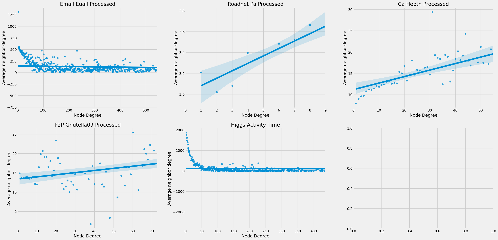

## Requisito II: Explorando a Assortatividade em Redes

A assortatividade de uma rede está intrinsecamente ligada à sua homogeneidade, fornecendo insights sobre como os nós na rede tendem a se conectar com outros que compartilham características semelhantes.

Uma métrica valiosa para a análise da assortatividade em uma rede é o "Grau Médio dos Vizinhos" (Average Neighbor Degree). Esse cálculo envolve a seleção de um conjunto de nós com um grau K específico em uma rede. Os graus de seus vizinhos são somados e, em seguida, a média desses valores é encontrada. É importante notar que, ao realizar esse cálculo para todos os graus possíveis na rede, podemos conduzir uma análise de regressão para entender a tendência dessas médias em relação aos graus dos nós. Isso nos permite fazer inferências sobre a assortatividade da rede como um todo. Se o grau médio dos vizinhos aumenta de forma linear com o grau, isso sugere que a rede é assortativa, indicando que nós com graus mais elevados têm uma tendência a se conectar com outros nós de graus mais elevados. Por outro lado, se a tendência for uma diminuição linear, a rede é considerada dessassortativa, sugerindo que nós com graus mais altos tendem a se conectar com nós de graus mais baixos. Esse método nos ajuda a compreender como os diferentes nós interagem na rede e a natureza das conexões entre eles.

Com base nessas informações, prosseguimos com a criação de gráficos de dispersão para examinar a relação entre o grau de cada nó na rede e a média dos graus de seus nós vizinhos, que estão conectados a nós com esse grau. A fim de aprimorar a visualização e identificar tendências de assortatividade ou dessassortatividade, geramos gráficos de regressão linear, incluindo a linha que melhor se ajustou aos pontos do conjunto de dados utilizado. Abaixo, apresentamos os resultados dessas análises para as cinco redes diferentes empregadas neste estudo.

Agora, para interpretar esses resultados, concentramo-nos nos coeficientes angulares das retas, que estão diretamente relacionados ao Coeficiente Linear de Pearson do grau. Retas com coeficientes positivos representam redes assortativas, indicando que nós com graus mais elevados tendem a se conectar com outros nós de graus mais elevados. Por outro lado, retas com coeficientes negativos representam redes dessassortativas, onde nós com maiores graus tendem a se conectar com nós de graus diferentes.

Analisando os gráficos, podemos destacar os seguintes pontos:

1. **Email EuALL e Higgs Activity Time**: Essas duas redes exibem dessassortatividade, como evidenciado pelos coeficientes angulares negativos, representando uma tendência de conexão entre nós de graus diferentes. Na rede Email EuALL, isso pode indicar a existência de grupos de usuários que enviam mais e-mails para outros do que para si mesmos. Na Higgs Activity Time, sugere que existem grupos de usuários que realizaram mais atividades, como retweets e respostas, antes do intervalo de tempo que contém a descoberta do bóson de Higgs.

2. **Roadnet PA, CA Hepth e P2P Gnutela 09**: Essas três redes apresentam bons níveis de assortatividade, como evidenciado pelos coeficientes angulares positivos, indicando que nós com graus mais elevados tendem a se conectar com outros nós de graus mais elevados. Para a rede Roadnet PA, isso pode significar que há poucas conexões entre grupos de estradas na Pensilvânia. No caso da CA Hepth, fica claro que existem mais artigos escritos por K coautores do que autoria direta de indivíduos I e J. Por fim, na P2P Gnutela 09, observamos uma maior conexão entre os hosts relacionados à topologia do Gnutela.

Assim, é possível notar que a assortatividade desempenha um papel fundamental na estrutura de diversas redes, influenciando como os nós se conectam. Enquanto algumas redes demonstram uma forte tendência de nós com graus similares se unirem, outras exibem o oposto, com nós de graus diferentes formando conexões significativas. Essas descobertas abrem portas para investigações futuras em áreas como redes sociais, sistemas de recomendação, resiliência de redes e modelagem de redes complexas, destacando a importância de compreender e aplicar os princípios da assortatividade em diversos contextos.
